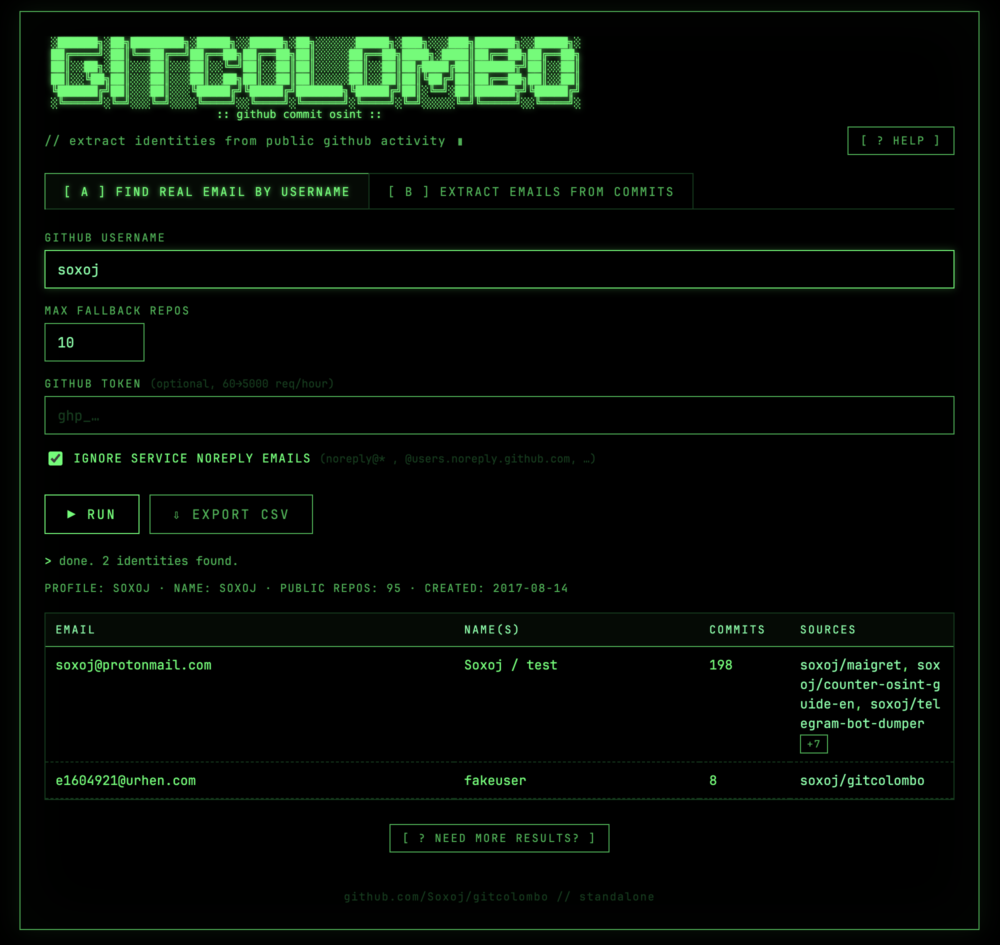

# Gitcolombo

<p align="center">
  
</p>

OSINT tool that extracts identities — names, emails, and links between
seemingly unrelated accounts — from git repositories and GitHub.

- **Python CLI** (`gitcolombo.py`) — clones repos, walks `git log`, and can
  call the GitHub API for richer signals.
- **Web version** (`gitcolombo.html`) — a single static HTML file; open it
  in a browser and query the GitHub API directly, no install.

For the full breakdown of where each email/name comes from
(PGP keys, public events, commit search, commit-message trailers, etc.)
see **[docs.md](./docs.md)**.

## Web version

Hosted at **<https://gitcolombo.soxoj.com>** — or open `gitcolombo.html`
locally. A single static HTML file that queries the GitHub API straight
from your browser; no install, no backend.

<p align="center">
  
</p>

## Install

Requires Python 3.10+ and a working `git` binary. No third-party
dependencies.

```sh
git clone https://github.com/Soxoj/gitcolombo
cd gitcolombo
```

## Usage

```sh
# from any git URL
./gitcolombo.py -u https://github.com/Soxoj/maigret

# from a local directory, recursively
./gitcolombo.py -d ./maigret -r

# clone and scan every public repo of a GitHub user/org
./gitcolombo.py --nickname octocat

# API-only: find emails for a GitHub username without cloning
./gitcolombo.py --search Soxoj

# change where remote repos get cloned (default: ./repos)
./gitcolombo.py -u https://github.com/Soxoj/maigret --repos-dir ./clones
```

Remote repositories are cloned into `./repos/` by default; override
with `--repos-dir`. For batch cloning from GitLab and Bitbucket groups
use [ghorg](https://github.com/gabrie30/ghorg).

## Output

- Per-person details: name, email, author/committer counts, and other
  identities that may belong to the same person.
- Emails that share a name.
- Different names tied to the same email.
- General statistics across the scanned repos.

## Why it works

Developers often commit with one identity (e.g. work account), then
switch to another (e.g. personal account) and run `git commit --amend`,
forgetting that this rewrites the *committer* but leaves the original
*author* in place. The two roles drift apart, and that mismatch is
exactly what gitcolombo correlates.

Short explainer on author vs. committer:
<https://stackoverflow.com/questions/18750808/difference-between-author-and-committer-in-git>

## Testing

Stdlib-only test suite — no third-party dependencies. From the repo root:

```sh
python3 -m unittest test_gitcolombo -v
```

The end-to-end test creates a real git repository in a temp directory,
so a working `git` binary is required (the test is skipped if `git` is
missing).

Tests run on every push and pull request via GitHub Actions
(`.github/workflows/tests.yml`) across Python 3.10–3.13.

## Further reading

- [docs.md](./docs.md) — extraction methods, ranking, filters, rate limits
- [RUS] <https://telegra.ph/Gitcolombo---OSINT-v-GitHub-03-02>

## Roadmap

- [x] Total statistics for repos in a directory
- [x] GitHub support: clone all repos from account/group
- [x] GitHub support: extract links to accounts from commit info
- [x] GitHub support: API pagination
- [x] Exclude "system" accounts (e.g. `noreply@github.com`, `@users.noreply.github.com`)
- [ ] Reverse mapping email → names (currently only name → emails)
- [ ] Probabilistic graph links based on shared names/emails and Levenshtein distance
- [ ] Other popular git platforms: GitLab, Bitbucket
